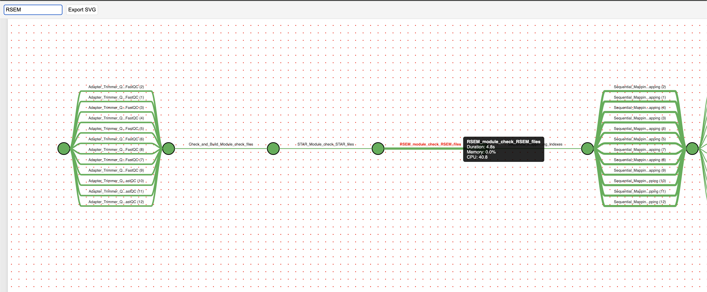

# workflow-trace-viewer

To run it 
1. Build the docker
   
docker build -t workflow-trace .

3. Run it by mounting trace.txt file

docker run --name workflow-trace --rm -p 3050:3000 -v $(pwd)/data/trace.txt:/data/trace.txt workflow-trace 

3. Go to the link below to see the plot

http://localhost:3050 

